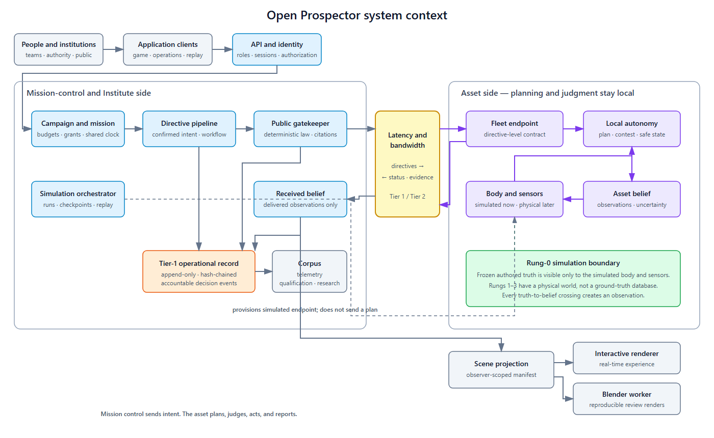
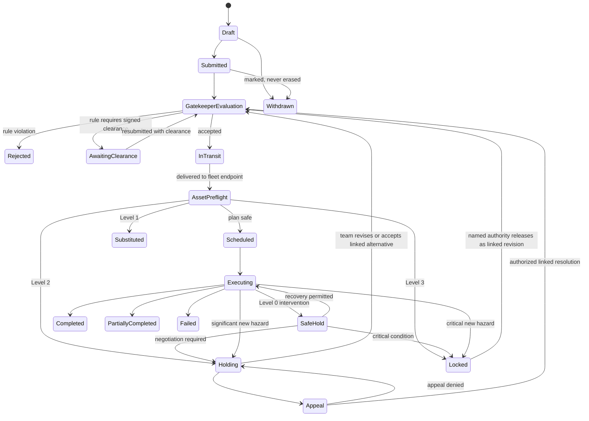

# Open Prospector Application Software Design

**Version:** Discussion draft 0.4
**Started:** 2026-09-07  
**Status:** Architecture proposal for owner review; not yet a program decision  
**Scope:** The Rung-0 consumer simulation and the software seams that let it
become the forward-planning twin and command-and-control interface for Earth,
lunar, and Mars fleets.

This document specifies the application that implements the Open Prospector
program. It does not replace the program design, settle its open questions, or
promote software choices into program decisions. Where the program has made a
decision, this design treats it as a constraint. Where the program deliberately
defers a formal artifact until Rung-0 evidence exists, this design supplies an
implementable working form and preserves the ability to revise it.

The executable working freeze for the first headless slice is
`vertical-slice-implementation-brief.md`; its JSON Schemas are under
`contracts/v0/`. Those artifacts make provisional, versioned engineering
choices without promoting them into program decisions.

## 1. Sources and authority

The source hierarchy is:

1. `mars-colonization/outline/mars-colonization-outline.md` for adopted
   decisions, especially D7, D16, D17, and D42.
2. `mars-colonization/papers/open-prospector-program.md` for the proposed
   graduated-contestation protocol, drone-as-role model, and Rung-0 product
   argument.
3. `open-prospector/design/program-design.md` for the program's PD decisions,
   gate criteria, allocation design, data tiers, and institutional boundaries.
4. The durable discussion record in Appendix A for the evolving-world-model and
   Blender integration direction originally developed with the owner on
   2026-09-07.

If this document conflicts with an adopted decision, the adopted decision wins.
The conflict should be recorded and resolved rather than silently normalized.

## 2. Product definition

Open Prospector is one application platform with several experiences over a
shared mission model:

- a consumer simulation that is enjoyable before hardware exists;
- a qualification environment that measures fleet-relevant skills;
- a campaign-planning and rehearsal twin;
- a directive, contestation, and authority interface for live operations;
- a public, auditable record and replay viewer;
- a data-producing research instrument for improving the interface, autonomy,
  and sim-to-real model.

Rung 0 must stand alone as a product. The future-fleet seams are architectural
constraints, not an excuse to make the first release look or feel like mission
operations software.

### 2.1 Required outcomes

The application must let a user:

1. experience how control changes across the D42 latency spectrum;
2. express intent as a directive with a goal, constraints, and desired evidence;
3. rehearse a directive against a versioned world and asset state;
4. observe an autonomous asset plan and act under uncertainty;
5. receive, evaluate, and answer a graduated contestation;
6. manage scarce position, risk, consumables, energy, and downlink as campaign
   state rather than as an isolated score;
7. inspect exactly what the asset knew, what mission control knew, and what the
   simulated world contained at a selected time;
8. replay an outcome from the same inputs, versions, and random seed;
9. understand why an action, substitution, refusal, lock, or authority override
   occurred.

### 2.2 Non-goals for the first release

- flight certification;
- high-fidelity modeling of every instrument or vehicle class;
- a generally intelligent rover;
- photorealism across the full planet;
- formal resolution of Q18 before Rung-0 evidence exists;
- a final qualification formula, campaign-allocation formula, or proprietary
  period while PQ11 remains open;
- making Blender files the source of world, science, or mission truth;
- using a language model as the sole safety, planetary-protection, or authority
  control.

## 3. Architectural principles

### 3.1 One domain model, multiple operating regimes

Telepresence, Earth-lag directive control, campaign rehearsal, and future live
operations use the same directive, asset-state, contestation, evidence, and
record types. Latency, bandwidth, embodiment, and environment are parameters.
The application must not fork into a "game protocol" and a later "real
protocol."

### 3.2 Truth, belief, and presentation are separate

The platform maintains at least four distinct projections:

- **simulated ground truth:** the environment actually used by the simulation;
- **asset belief:** what a rover, copter, spelunker, human, or compound operator
  currently infers from its sensors and prior observations;
- **mission-control belief:** what has arrived through the configured latency
  and bandwidth channel;
- **presentation view:** the authorized combination selected for a player,
  operator, reviewer, authority, or replay viewer.

Ground truth must never leak into an operational belief view through rendering,
pathfinding, labels, AI context, or client APIs. A developer or post-campaign
analysis view may reveal it explicitly.

Four enforcement rules make that separation more than an API convention:

1. Sensor models are the only runtime components allowed to read both simulated
   truth and asset belief, and every crossing produces an observation event.
2. A rehearsal for a future or physical campaign runs against hypotheses
   generated from current belief and uncertainty, not against inaccessible
   truth. Its sampling and aggregation policy must be versioned and reported
   with the result; until that policy exists, the first vertical slice performs
   deterministic endpoint preflight only and makes no rehearsal claim. Only an
   authoritative simulated scenario run uses its frozen authored truth.
3. Belief entities have belief-scoped identifiers. The truth-to-belief mapping
   exists only inside the simulated truth/sensor boundary.
4. A frame shown to a telepresence operator is a sensor observation. It updates
   asset belief before it leaves the fleet endpoint and cannot contain hidden
   labels, geometry, or metadata from the truth layer.

### 3.3 The world model is authoritative; renderers are projections

Terrain, entities, scientific properties, provenance, discovery state, and
belief assertions live in an external, versioned world model. Blender and any
real-time client receive scene manifests derived from a selected world snapshot
and observer view. They may cache mirrored metadata, but edits to a `.blend`
file do not mutate authoritative state.

### 3.4 Deterministic core, recorded uncertainty

The authoritative simulator advances on a fixed timestep. Given the same
archived build, supported platform, world snapshot, asset state, ruleset,
directive, input log, and random seed, it must re-execute deterministic
components and reproduce the authoritative record events. Probabilistic
perception and learned-model outputs are persisted with model identifier, input
evidence, confidence, and returned result, then injected during replay. Replay
therefore verifies deterministic behavior around an immutable nondeterministic
result; it does not claim to reproduce the model service. A cross-build or
cross-platform execution is a new compatibility run compared under declared
tolerances. A counterfactual is always a new run identity.

### 3.5 Rules first, learned components at bounded seams

The first autonomy stack is finite-state control, path planning, rule checks,
and weighted scoring. Vision or language models may classify ambiguous sensor
products, help a user draft a structured directive, summarize events, or rank
alternatives. They do not directly write ground truth, bypass the gatekeeper,
release a Level-3 lock, or actuate a live asset. No learned component may sit in
a Level-0 reflex path.

### 3.6 Append the record; transact the application; checkpoint the simulation

The Tier-1 operational record is append-only. Withdrawal, correction,
supersession, and authority override add record events and never erase the
original. Campaigns, accounts, content, and other application state use ordinary
transactional storage and emit record events only at accountable decision
points. High-rate simulation state uses fixed-timestep execution, checkpoints,
an input log, and a run manifest rather than one durable event per tick. Public
views and audit replays derive from the record; product views may derive from
the transactional domain store.

### 3.7 Stable open boundary, replaceable implementation

The directive interface, contestation grammar, record format, and adapter
contracts form the publishable open layer required by PD5 and PD7. Simulation
engines, renderers, learned models, and eventual controlled flight components
sit behind versioned interfaces and can change without changing what a team
submits or what the record means.

### 3.8 Logical components before network services

The first implementation should be a modular server application plus isolated
workers for simulation and rendering. Component boundaries below are code and
data-ownership boundaries. They become independently deployed services only
when scaling, security isolation, or hardware operations justify the cost.

## 4. People, roles, and experiences

| Role | Primary experience | Special authority |
|---|---|---|
| Player/operator | Telepresence or directive-mode exploration | Controls only allocated simulated state |
| Campaign team member | Plans, rehearses, submits, monitors, and responds | Acts within a campaign role and budget |
| Qualification candidate | Runs scored scenarios and receives evidence-based feedback | None over qualification criteria |
| Peer reviewer | Reviews proposals and twin rehearsals | Recommends allocation; does not operate assets by default |
| Campaign authority | Supervises campaigns and resolves appeals | Named human may release a Level-3 lock |
| Planetary-protection rules authority | Supplies or approves human-authored rules and any rule-required clearance | Has only the authority named by the applicable rule and institution |
| Studio live-operations staff | Operates the consumer service and content | Cannot alter Institute criteria or allocation outcomes |
| Institute administrator | Publishes standards, criteria, and campaign policy | Owns policy versions; cannot rewrite history |
| Public observer/researcher | Searches records, watches delayed operations, and replays events | Read-only, subject to science-data proprietary periods |

### 4.1 Telepresence experience

The user controls an asset or operator-plus-avatar compound in real time at a
configured low latency. Level-0 envelope protection may arrest, hold, or clip a
command when the negotiation window is closed. The intervention is rendered
immediately with its evidence and justification. Repeated near-misses may
escalate to Level 1. Telepresence teaches the reflex end of the same protocol
used by directive mode; it is not a safety-free arcade mode.

The reflex envelope and fixed-timestep simulation core are one deterministic
library embedded in the interactive client for immediate feel and in the
authoritative verifier. A client is never trusted; ranked authority is
established by replaying its signed input log. Unranked local play may remain
client-authoritative without producing qualification evidence.

### 4.2 Earth-lag directive experience

The team works from a delayed mission-control view. It declares a scientific
goal, selects a region or target, requests evidence, constrains risk and
resources, and submits a directive. The asset performs plan-time evaluation
locally, then executes, substitutes, holds, or locks according to the protocol.
Replies arrive through the same simulated communications channel. The core game
is intent craft, planning under incomplete information, patience, and resource
stewardship.

### 4.3 Campaign experience

A campaign composes many directives against a shared, path-dependent state
grant. The team rehearses its proposed campaign, manages five budget currencies
from PD8, negotiates hand-offs and exit conditions, and selects which Tier-2
science products to transmit. Sim-tier campaigns remain useful after hardware
exists because they produce forward-planning evidence.

### 4.4 Public record and replay experience

The record viewer presents the whole chain together: directive, goal,
gatekeeper result, plan, evidence, contestation, alternatives, team response,
execution, and resolution. A viewer can switch among the asset-belief,
mission-control-belief, and authorized ground-truth views at a chosen event
time. Safety-significant events support immediate publication; embargoed
science products show metadata and release status without leaking payloads.

## 5. System context and component boundaries

Read left to right: mission control sends a gatekeeper-cleared directive across
the communications channel. The fleet endpoint plans, contests, and acts
locally, then returns status and evidence through the same channel. Authored
ground truth exists only inside the Rung-0 simulation boundary; observer-scoped
belief drives application and rendering views.

### 5.1 Client applications

Client applications render the experience and submit intent. They are never
trusted for budgets, campaign time, qualification, gatekeeper outcomes, records,
or live-asset commands. For telepresence feel, a client may execute the shared
deterministic reflex/simulation library locally; ranked results become
authoritative only after server replay verifies the input log. A single client
may expose several modes, but its role and view permissions must be explicit.

### 5.2 Application API and identity

Owns authentication, team membership, role-based authorization, session state,
API versioning, request idempotency, and rate limits. Public record reads are
anonymous where practical. Authority and PP actions require stronger identity,
short-lived credentials, and signed events.

### 5.3 Campaign and mission domain

Owns proposals, awards, campaign rosters, state-vector budgets, asset grants,
exit conditions, return-to-readiness intervals, and role assignments. Rung 0
may begin with authored solo scenarios, but they use the same campaign and
budget primitives needed by multiplayer and later operations.

### 5.4 Directive pipeline

Owns directive drafts, validation, submission, versioning, workflow state,
responses, and linkage to plans and evidence. It coordinates the gatekeeper,
preflight simulation, autonomy runtime, communications channel, and record but
does not absorb their rules.

### 5.5 Planetary-protection gatekeeper

Executes public, versioned, human-authored policy as deterministic rules. It
returns accepted or rejected with machine-readable rule citations. A rule may
make a signed external clearance a prerequisite; until that artifact is present,
the directive is rejected as missing a named authorization rather than placed
into negotiation. It does not negotiate: law is distinct from situational asset
judgment. A language model may explain a result but cannot produce or reverse it.

### 5.6 Simulation orchestrator

Creates an immutable run manifest, reserves compute, selects a world snapshot,
loads an asset model, applies a ruleset and random seed, advances simulation
time, checkpoints state, and commits resulting events and artifacts. It supports
faster-than-real-time rehearsal, real-time telepresence, paused inspection, and
deterministic replay.

### 5.7 World and belief model

Owns spatial tiles, terrain, entities, properties, observations, beliefs,
provenance, uncertainty, and refinement history. It exposes observer-scoped
queries so consumers cannot accidentally request facts they should not know. In
Rung 0, authored truth exists only inside the simulated body/sensor boundary. In
Rungs 1-3 there is no ground-truth store: the physical world and sensor evidence
replace it, so any non-simulator component that requires truth is incorrectly
designed.

### 5.8 Autonomy runtime

Runs on the asset side of the communications channel and implements mission
interpretation, planning, hazard detection, state-machine control,
counter-proposal generation, safe-state behavior, and telemetry. Every decision
is attributable to an autonomy-stack version. The runtime receives cleared
directives, not Earth-approved plans, and operates on asset belief, never
unrestricted ground truth.

### 5.9 Communications channel

Models one-way and round-trip latency, scheduled contacts, loss, ordering,
priority, and bandwidth. Tier 1 record closure and Tier 2 science allocation are
separate queues. In Rung 0 and Earth analog work this component injects
constraints; in later rungs an adapter maps them to physical links.

### 5.10 Operational record

Stores the canonical append-only event chain and evidence references, produces
public and embargo-aware projections, signs checkpoints, and supports
independent mirroring. It is separate from high-volume telemetry and science
artifact storage so the small Tier-1 record can close even when Tier 2 cannot.

### 5.11 Scene projection and rendering

Transforms an observer-scoped belief snapshot, or an explicitly authorized
developer/post-campaign truth view, into a renderer-neutral scene manifest. A
Blender worker uses the manifest for reproducible stills, video, overlays,
validation images, and high-detail review. The interactive game renderer may use
a different engine while consuming the same manifest contract.

### 5.12 Telemetry, qualification, and corpus

Stores high-volume gameplay telemetry separately from the public operational
record. It derives qualification evidence from Institute-owned, versioned
criteria; creates privacy-preserving research datasets; measures interpretation
quality, counter-proposal acceptance, escalation distribution, calibration,
rage-quit behavior, and sim-to-real correlation. A criterion change creates a
new scoring version and never rewrites an earlier result.

### 5.13 Fleet endpoint contract

Defines a fleet endpoint by protocol fluency: it accepts a gatekeeper-cleared
directive, plans locally against its own belief, contests in the common grammar,
executes, and emits observations, health, and record events. The Rung-0 endpoint
bundles the autonomy runtime, asset belief, sensor models, and simulated body.
Future hardware endpoints replace the simulated body and sensors without moving
planning to mission control or weakening gatekeeper, contestation, and record
invariants. Capability negotiation and cryptographic hardware attestation are
deferred until the Rung-1 bridge.

## 6. Authoritative data model

### 6.1 Identity and versioning

Every durable object has a stable identifier. Every mutable specification has a
version identifier and validity interval. Events refer to exact versions, never
to an unqualified current value.

The **scenario** is the unit of Rung-0 content. It pins a truth snapshot, initial
observer beliefs, asset configuration, ruleset, budgets, objectives, clock, and
permitted modes. Truth is frozen for the duration of a run; authoring creates a
new scenario or snapshot version between runs.

Core identities include:

- user, team, role assignment, and authority identity;
- campaign, proposal, award, state grant, and exit condition;
- asset role, embodiment, capability set, configuration, and autonomy version;
- directive, declared goal, constraint, response, and resolution chain;
- world, region, tile, entity, property assertion, and snapshot;
- observation, evidence artifact, belief assertion, and model output;
- plan, execution step, hazard, contestation, alternative, and intervention;
- PP ruleset and gatekeeper evaluation;
- simulation run, checkpoint, random seed, and scene manifest;
- record event, hash-chain checkpoint, publication class, and artifact manifest.

### 6.2 Scientific properties

A world entity may carry typed properties such as composition, hardness, mass,
friction, morphology, thermal behavior, sample value, or contamination risk.
Each property assertion records:

- value and unit;
- uncertainty or distribution;
- source and method;
- observation or derivation references;
- valid time and recorded time;
- confidence and classification vocabulary version;
- visibility class and proprietary status.

The truth layer may know that a rock is basalt with a particular composition.
An asset belief may only classify it as a dark igneous candidate at 0.68
confidence. Mission control learns that assertion only after its evidence and
event cross the channel.

### 6.3 Spatial model

Worlds are partitioned into stable, hierarchical tiles in a declared coordinate
reference system. A tile version contains or references:

- elevation and surface mesh at one or more levels of detail;
- imagery and material layers;
- collision and traversability products;
- environmental fields such as illumination, temperature, wind, or dust;
- entity placements and bounding volumes;
- provenance, resolution, uncertainty, and source licenses;
- adjacency and seam metadata.

Refinement creates a new tile version or a bounded patch over a parent version;
it does not mutate history. Cross-tile operations use declared seam and datum
rules. The simulation selects physical fidelity by region and task, not by
visual distance alone.

### 6.4 Temporal model

Events distinguish:

- **simulation time:** when an event occurs in the modeled world;
- **observed time:** when a sensor produced evidence;
- **recorded time:** when a component durably appended the event;
- **received time:** when a particular observer's channel delivered it;
- **valid time:** the interval for which an assertion claims to apply.

This distinction is required for delayed mission-control belief, out-of-order
delivery, replay, and later comparison with hardware clocks. A campaign owns one
shared simulation clock. Its rate relative to wall time is a session parameter;
`L` and `T` are always measured in simulation time, and time compression may not
shrink `L` relative to `T` or otherwise cheat the negotiation window.

### 6.5 Refinement event

A refinement event identifies the affected region, parent snapshot, replacement
tile or patch, prior and new resolution, acquisition source, processing pipeline
version, confidence, and effective time. During a run, refinement updates an
observer's belief only. Ground-truth refinement is an authoring/ingest operation
that creates a new snapshot between runs; the two operations have different
types and permissions.

### 6.6 Run manifest

Every authoritative simulation run records:

- world and tile snapshot identifiers;
- asset, instrument, autonomy, physics, gatekeeper, and scenario versions;
- campaign state and directive version;
- latency and bandwidth profile;
- random seed and clock configuration;
- external model invocations and recorded responses;
- input artifact hashes;
- build identity and compatibility version.

The immutable pre-run manifest cannot know its output chain head. A separate
run-closure event records that head and the final state hash.

## 7. Directive and execution lifecycle

### 7.1 Directive envelope

The working directive type contains:

- identity, author, team, campaign, and parent/superseded directive;
- declared goal and success evidence;
- target region, target entity, or allowed operating envelope;
- constraints, priorities, and permitted substitutions;
- requested asset capabilities and instruments;
- budget ceilings for time, traverse, risk, consumables, energy, and Tier-2
  downlink;
- earliest start, deadline, timeout, and safe-idle behavior;
- team-provided route or method as an advisory plan, not hidden intent;
- optional source text plus the exact user-confirmed structured interpretation;
- signatures and schema version.

Coordinates without a goal are insufficient for a fleet directive. In training
scenarios they may be accepted only when the learning objective explicitly
demonstrates why they are insufficient.

A player may begin with free text. Any model may help turn it into a structured
draft, but the player confirms that structure before submission. The structured
form alone drives gatekeeper and autonomy behavior. Qualification pins the
structured schema and does not depend on a changing interpretation model. When
authorized for corpus collection, the source-text/confirmed-structure pair is
retained as training evidence under its own privacy policy.

### 7.2 Processing sequence

1. Validate schema, identity, campaign authority, asset grant, budgets, and
   idempotency.
2. Evaluate the directive against the exact gatekeeper ruleset.
3. Transmit the cleared directive, not a plan, through the communications
   channel to the fleet endpoint.
4. On the asset side, create a preflight run against asset belief and permitted
   onboard products; do not use hidden ground truth.
5. Interpret the confirmed goal, generate candidate plans, estimate resource
   use, and evaluate hazards and confidence locally.
6. Apply the escalation ladder and negotiation-window rule, then transmit the
   plan summary, contestation, or status as Tier-1 events.
7. Pass team responses back through the same channel; accept, revision, and
   appeal do not bypass latency.
8. During execution, reassess state and hazards locally; safe reflexes can act
   without a round trip and must justify afterward.
9. Reconcile observations, budgets, asset health, beliefs, and completion state.
10. Publish record events on the appropriate disclosure clock and queue science
    products under their Tier-2 and proprietary rules.

Campaign rehearsal uses a simulated fleet endpoint under the same sequence. A
rehearsal of a physical or future campaign runs against hypotheses sampled from
available belief and uncertainty, never privileged physical ground truth.

## 8. Autonomy and graduated contestation

### 8.1 Initial autonomy loop

The first runtime uses:

- a constrained mission interpreter for goals and constraints;
- A* or another inspectable planner over a traversability graph;
- deterministic safety rules for slope, obstacle, geofence, energy reserve,
  consumables, communications, and asset envelope;
- weighted plan scoring for safety, scientific value, reachability, resource
  cost, reversibility, and uncertainty;
- a finite-state controller for idle, planning, awaiting response, executing,
  safe hold, recovery, locked, completed, and faulted states;
- bounded visual reasoning for features absent from structured terrain;
- structured event generation followed by optional plain-language summaries.

The asset should stop, image, mark uncertainty, select a safer alternative, or
ask mission control when confidence falls below a versioned policy threshold.

### 8.2 Negotiation window

For a hazard with time-to-harm `T` and directing-human round-trip latency `L`:

- when `L` is much less than `T`, contest before acting;
- when `L` approaches or exceeds `T`, enter or preserve safe state and justify
  afterward.

The runtime calculates `T` from a hazard-specific model and records the inputs,
result, and policy threshold. `L` comes from the active communications profile,
not from a client-side setting.

### 8.3 Working contestation type

Until G1-3 freezes the formal Q18 artifact, every contestation must at least
carry:

- contested directive and preserved goal;
- hazard class and evidence references;
- reason, confidence, and severity;
- computed negotiation-window inputs and result;
- zero or more alternatives, with zero permitted for a reflex whose held
  safe state is the immediate alternative, or a Level-3 lock when no permitted
  safe goal-preserving alternative exists;
- disposition: executed variant, holding, or locked;
- asset identity and autonomy-stack version;
- creation, publication, response, and resolution times;
- signatures or attestations required by operating rung.

### 8.4 Alternative grammar

Counter-proposals compose five moves from the paper: substitute vantage,
substitute instrument, substitute target, defer, and partial execution. Each
alternative declares how it preserves the goal, changes the risk/resource
estimate, and affects requested evidence. The team can accept, revise, or appeal
at Level 2. Only the named campaign authority can release Level 3, and that act
is a signed public event.

In ordinary Studio-operated solo and casual play, a Level-3 lock is final for
that directive. The player may submit a different lawful directive, but no
Studio role can create a release event. Level-3 release exists only in an
Institute-supervised campaign with a named campaign authority. This makes the
PD5/PD6 separation enforceable in deployment and signing authority rather than
merely visible in the user interface.

### 8.5 Safety invariants

- Gatekeeper rejection cannot be converted into an autonomy alternative.
- No asset, team, model, Studio administrator, or automated workflow can release
  a Level-3 lock.
- Client loss, timeout, or sleeping teams resolve to a declared safe-idle state.
- A released Level-3 directive returns to asset preflight because world, belief,
  asset, and budget state may have changed while it was locked.
- A model failure or unavailable inference service degrades to deterministic
  rules, safe hold, or explicit inability; it never silently widens authority.
- Learned outputs are evidence-bearing proposals until deterministic policy or
  an authorized human consumes them.
- The planner never reads properties outside the asset's authorized belief view.

## 9. Evolving world model and rendering

### 9.1 World refinement workflow

1. A sensor or authored scenario produces an immutable observation artifact.
2. A processing pipeline derives measurements or classifications with
   uncertainty and provenance.
3. Belief fusion proposes new or revised assertions for an observer.
4. Policy determines whether the result updates only asset belief, crosses the
   channel to mission-control belief, or remains private to the observing role.
5. A refinement event creates a new tile version or patch.
6. Traversability, scientific-target, and scene projections invalidate only the
   affected region and dependencies.
7. Replays retain the old snapshot; new runs select the refined snapshot
   explicitly.

### 9.2 Blender contract

Blender receives a scene manifest containing:

- world snapshot and observer-view identifiers;
- spatial region and level-of-detail policy;
- terrain and entity asset references with transforms;
- permitted property overlays and discovery state;
- asset pose, planned/executed paths, annotations, and camera definition;
- lighting, atmosphere, simulation time, renderer version, and output profile.

The worker can regenerate a scene from an empty template for canonical outputs
or incrementally update a cached scene for interactive review. Canonical renders
must be reproducible from a manifest and content-addressed assets. Incremental
mode is a performance optimization, never a separate source of state.

Blender may also be an upstream authoring tool. Export from Blender must pass
through validation and ingest to create new content-addressed source assets and
a new world snapshot. Saving an authoring scene never updates a run or snapshot
in place.

### 9.3 Recommended rendering split

Use Blender for source-asset preparation, scientific overlays, high-detail
stills/video, validation, and reproducible review renders. Keep the scene
contract renderer-neutral and choose the real-time engine after a vertical-slice
prototype measures terrain streaming, input latency, packaging, accessibility,
and mod/content workflow. Making Blender the consumer real-time runtime is not
assumed by this design.

Collision, scale, slope, and traversability products derive from source DTMs and
a recorded processing pipeline. They never derive from a decimated visual mesh
or artist-authored render geometry without a separate validated physical asset.

## 10. Record, telemetry, qualification, and privacy

### 10.1 Three stores with different duties

1. **Operational record:** small, append-only, hash-chained Tier-1 events and
   evidence manifests; public on the PD10 clock and independently mirrorable.
2. **Science artifacts:** high-volume Tier-2 products with campaign allocation,
   integrity metadata, and proprietary-release controls.
3. **Product telemetry:** gameplay, UX, anti-abuse, and performance data used by
   the Studio; not automatically part of the public record.

The stores may share infrastructure initially but have separate schemas,
retention, access, publication, and export rules.

Working default: solo and casual play produces product telemetry only.
Qualification runs and the sim-tier campaigns that constitute real allocation
under program-design Section 4.5 produce operational-record events. Crossing
that boundary is an explicit scenario/campaign classification made before a run,
never a retroactive publication choice.

### 10.2 Qualification

Qualification is computed from signed scenario/run evidence under a specific
Institute-owned criterion version. The Studio may operate scoring services but
cannot change criteria, create a passing result, or grant allocation. Anti-cheat
signals may invalidate a run only through an auditable review process. Public
qualification views should disclose standing and evidence categories without
publishing unnecessary personal or behavioral telemetry.

### 10.3 Corpus construction

Training and research exports reference directives, interpretations,
contestation chains, outcomes, and calibration labels by immutable identifier.
They exclude private account data and respect science proprietary periods.
Derived datasets publish their selection logic and source event range so a later
model can be audited against the exact corpus it used.

## 11. Security and trust boundaries

- Treat clients, mods, user-authored directives, uploaded artifacts, and model
  output as untrusted.
- Validate authority, budgets, schema, and state transitions on the server.
- Isolate simulation and Blender workers from account secrets and authority
  signing keys.
- Confine authored truth and truth-to-belief mappings to the simulated
  body/sensor security boundary; rehearsal and mission-control services receive
  only belief-scoped data.
- Run gatekeeper rules from signed, immutable bundles; make source and active
  version public.
- Hold Level-3 release keys outside Studio administration and require named
  human signatures.
- Separate personally identifying account data from public records and research
  telemetry.
- Encrypt embargoed science artifacts and audit access.
- Content-address world assets, evidence, run manifests, and published record
  checkpoints.
- Rate-limit directive submission and expensive rehearsal to resist spam and
  denial of service.
- Require fail-closed compatibility at every fleet endpoint; add capability
  negotiation and hardware attestation for the Rung-1 bridge.
- Keep the open interface and record formats separable from any export-controlled
  twin, model weights, or flight implementation, pending PQ10.

## 12. Nonfunctional requirements

Targets remain to be frozen, but the categories are requirements now.

### 12.1 Reproducibility and audit

- Deterministic replay for authoritative simulation runs.
- Archive the runnable build, dependency manifest, and platform profile needed
  to exercise an escrowed replay; record data without executable semantics is
  insufficient for behavioral audit.
- Exact version and provenance capture for every decision-bearing input.
- Public verification of event-chain completeness and signatures.
- No history-changing administrative operation.

### 12.2 Fidelity

- Published fidelity envelope by subsystem and region.
- Explicit distinction between visual, navigational, instrument, environmental,
  and behavioral fidelity.
- Scenario-level comparison hooks for Rung-1 sim-to-real measurements required
  by G1-5 and G2-1.

### 12.3 Performance

- Low-latency local envelope protection in telepresence mode.
- Faster-than-real-time batch rehearsal.
- Spatial streaming and partial invalidation for refined tiles.
- Graceful reduction of render fidelity without changing simulation truth.

### 12.4 Reliability

- Idempotent submission and event ingestion.
- Recoverable checkpoints for long simulations.
- Safe behavior across client disconnects, worker failures, delayed/out-of-order
  messages, and unavailable learned-model services.
- Tier-1 record production independent of Tier-2 artifact throughput.

### 12.5 Accessibility and explainability

- Contestations and evidence available as text, structured data, and visual
  overlays.
- Color-independent hazard and confidence cues.
- Keyboard/controller remapping and time controls appropriate to each mode.
- Plain-language explanations derived from, and linked to, structured events.

### 12.6 Portability and longevity

- Open, documented schemas with compatibility tests.
- Renderer-neutral scene manifests and embodiment-neutral fleet contracts.
- Exportable public records that do not require the application to read.
- Version migration by new projections or events, not rewriting archived data.

## 13. Rung evolution

| Capability | Rung 0 | Rung 1 | Rung 2 | Rung 3 |
|---|---|---|---|---|
| Fleet endpoint | Simulated body, sensors, local belief, and autonomy | Earth body/sensors with the same local directive interface | Lunar endpoint with supervisory abort | Mars endpoint and local autonomy |
| World truth | Authored Mars/analog simulation | Simulation plus measured analog ground truth | Lunar truth products | Mars truth products |
| Latency/bandwidth | Configured and injected | Mars constraints injected | Mars constraints injected over real lunar link | Physical Mars link |
| Authority | Scenario/live-ops roles | Exercised Institute office | Flight authority plus lunar PP | Flight authority plus Mars PP |
| Record | Sim campaign and safety events | Full physical campaign rehearsal | Certified deep-space record path | Operational Mars record |
| Fidelity work | Baseline and calibration corpus | Enumerate and reduce sim-to-real gaps | Validate deep-space operations | Continuously refine from Mars observations |

The migration rule is: replace endpoint embodiments and fidelity models, not directive,
contestation, campaign, belief, or record semantics. Rung-specific safety cases
may narrow allowed behavior; they cannot widen a role's authority invisibly.

## 14. First vertical slice

Build one end-to-end scenario before choosing the complete engine or service
topology. The exact provisional algorithms, wire frames, state transitions,
schemas, fixture encoding, and test matrix are frozen for implementation in
`vertical-slice-implementation-brief.md` and `contracts/v0/`.

### 14.1 Scenario

The first slice is deliberately headless and split into two processes. A
mission-control process holds the confirmed directive, gatekeeper, campaign
clock, channel, received belief, Tier-1 record, and a single Tier-2 counter. A
fleet-endpoint process holds local autonomy, asset belief, sensor models, and a
simulated rover/body on one real-data-derived Mars tile. Neither process imports
the other's implementation.

Mission control sees a coarse, delayed belief map. The player submits a
goal-bearing directive to characterize a hydrated-mineral candidate and suggests
a short route. An authored slump hazard is absent from mission-control belief
but visible to an asset-side local sweep. Local preflight planning files a
Level-2 contestation with a safer standoff vantage and substitute target. After
injected latency, mission control accepts one alternative. The rover executes,
encounters an unmapped rock, enters reflex safe hold, records `L` and `T`, uses
one stubbed classifier seam with a recorded output, updates asset belief, and
completes a standoff observation after the new belief crosses the channel.

### 14.2 Included software

- versioned directive and goal schema;
- one deterministic PP/geofence rule;
- one tiled world snapshot with truth and two belief projections;
- rover kinematics, energy, slope, obstacle, and communications models;
- A* route planning and a finite-state autonomy controller;
- Level-2 contestation with two structured alternatives;
- Level-0 reflex safe hold with no learned component in the reflex path;
- latency and Tier-1/Tier-2 queue simulation;
- append-only local record with event hashes;
- one recorded, stubbed nondeterministic classifier result;
- replay from the original manifest and seed.

The slice excludes account identity, a real-time engine, Blender, signing keys,
and hardware attestation. Slice two adds the interactive client, shared local
reflex library, and Blender scene-manifest worker.

### 14.3 Acceptance criteria

The slice is complete when:

1. two runs of the same archived build and manifest reproduce the same
   authoritative event chain, with the recorded classifier result injected;
2. mutating truth outside the sensed region leaves the implementation brief's
   no-leak projection byte-identical until an observation of that region crosses
   the channel; provenance hashes correctly continue to identify different
   inputs;
3. the gatekeeper, contestation, and authority paths are visibly distinct;
4. accepting an alternative creates a new linked directive/resolution event and
   preserves the original;
5. the new observation refines asset belief before it reaches mission-control
   belief;
6. latency and downlink constraints alter what the player knows and when;
7. a second supported machine/platform reproduces the chain byte-for-byte; the
   integer `slice-v0` profile declares no numeric tolerance;
8. the audit replay explains each hold, route change, and budget expenditure
   from structured evidence;
9. swapping the simulated body/sensors for a fake hardware endpoint requires no
   mission-control or record-schema change;
10. both the plan-time Level-2 hold and run-time Level-0 reflex occur with
    recorded negotiation-window inputs;
11. a small facilitated playtest can understand and choose between the two
    alternatives without access to hidden truth.

## 15. Delivery sequence

1. **Schema and replay foundation:** identifiers, event envelope, run manifest,
   spatial tile contract, observer-scoped belief query, and compatibility tests.
2. **Headless vertical slice:** the Section 14 two-process scenario with
   deterministic rules, truth-leak tests, and no rendering dependency.
3. **Experience prototype:** add a deliberately plain client, compare real-time
   engine options, integrate the Blender worker, and test telepresence and
   Earth-lag loops with users.
4. **Campaign alpha:** multi-user teams, state-vector budgets, authored scenario
   tools, record viewer, telemetry separation, and preliminary qualification
   evidence.
5. **Rung-0 live product:** scalable content delivery, community/live operations,
   anti-abuse, public record mirroring, corpus governance, and published fidelity
   envelope.
6. **Rung-1 bridge:** hardware adapter, clock synchronization, field evidence,
   abort and recovery procedures, and sim-to-real comparison pipeline.

Each stage must yield a runnable product and evidence for the next choice. Engine
selection follows the vertical slice rather than preceding it.

## 16. Proposed defaults for owner review

These are software recommendations, not adopted program decisions:

1. Begin as a modular application with simulation and Blender workers, not as
   independently deployed microservices.
2. Use an append-only Tier-1 record, transactional application state, simulation
   checkpoints/input logs, and immutable versioned spatial snapshots.
3. Keep ground truth and each observer's belief in separate query scopes and
   projections.
4. Use a renderer-neutral scene manifest; use Blender as a deterministic
   rendering/asset worker rather than assuming it is the consumer runtime.
5. Start autonomy with inspectable rules, A*, scoring, and a finite-state
   controller; add learned perception and interpretation only at recorded seams.
6. Make the simulator the first implementation of the same asset-side fleet
   endpoint contract later used by hardware; mission control always sends a
   directive, never an approved plan.
7. Separate operational record, science artifacts, and Studio product telemetry
   from the first prototype onward.
8. Prototype the Earth-lag directive loop first as the architectural spine, then
   add telepresence against the same domain model.

## 17. Open application questions

### Product and experience

1. What is the first commercial promise: single-player exploration, cooperative
   campaign operations, competitive qualification, or a deliberate combination?
2. How much ground truth can a consumer sandbox reveal without teaching habits
   that invalidate qualification?
3. Is telepresence the acquisition/onboarding experience while Earth-lag mode is
   the long-term campaign game, as D42 suggests?
4. Which content is authored, procedurally generated, or reconstructed from real
   terrain in the first release?

### Simulation and rendering

5. Which real-time engine should consume the renderer-neutral scene contract?
6. What fidelity is required for the directive loop, and what additional local
   fidelity is required for telepresence?
7. Which Mars region and data products are complete enough for the first tile?
8. What is the authoritative spatial reference, tile hierarchy, and content
   packaging format?
9. What reviewed authoring workflow may promote imported or authored evidence
   into a new future truth snapshot without implying that an observation changed
   physical ground truth?

### Autonomy and protocol

10. What constrained directive grammar is expressive enough for play but stable
    enough to train against?
11. How are hazard confidence and severity calibrated before a large corpus
    exists?
12. What thresholds distinguish Levels 0-3 in the working Rung-0 protocol?
13. What bounded perception/classification model use is permitted in
    ranked/qualification runs, and how are pinned model-result seams normalized?
14. How does a player challenge a Level-1 auto-substitution without turning
    every minor event into a slow appeal workflow?

### Campaign, record, and governance

15. Does owner review accept the working default that solo/casual runs produce
    product telemetry while qualification and allocated sim campaigns enter the
    operational record?
16. What explicit scenario/campaign status and consent flow marks the boundary
    between ordinary play, qualification evidence, and real sim allocation?
17. What temporary working schemas are allowed before G1-3 freezes the formal
    artifacts, and how will migration preserve old chains?
18. Which values from PQ11 must be represented as configurable policy rather
    than compiled behavior?
19. What is public under a username, team identity, pseudonym, or anonymized
    research identifier?

### Technology and operations

20. Which implementation languages and deployment targets best span consumer
    clients, deterministic simulation, geospatial processing, and later C2?
21. What offline capability is required for the consumer product?
22. What modding or community-content boundary is safe for ranked scenarios?
23. Which open schemas belong in a separate standards package from the start?
24. How should PQ10's eventual export determination partition repositories,
    build pipelines, staff access, and model artifacts?

## 18. Known tensions and hazards

- The paper says formal Q18 artifacts are deferred until Rung-0 evidence, while
  G0-2 requires an implementable protocol before building Rung 0. The software
  therefore needs explicitly provisional, versioned schemas and state machines;
  pretending they are final would violate the learning purpose of the rung.
- The game is expected to be a consumer product, qualification funnel, training
  corpus, and later operational twin. A single UI or data-retention policy cannot
  serve all four. Shared semantics with role-specific products is safer than one
  universal interface.
- Photoreal rendering and navigational fidelity are different. Optimizing a
  Blender scene for appearance can silently corrupt slope, collision, scale, or
  uncertainty unless the scene remains a projection of simulation geometry.
- An event log alone is not a public accountability record. The record also
  needs stable semantics, evidence retention, signatures, disclosure policy,
  accessible presentation, and independent verification.
- Qualification based on mutable models or live service behavior will be hard to
  compare over time. Ranked runs need pinned versions and replayable model
  outputs.
- The Studio operates the game but cannot control qualification criteria or
  allocation. That institutional boundary must exist in authorization, signing,
  deployment, and audit design rather than only in organizational prose.
- Future flight software may be export-controlled. The open directive and record
  layer needs a clean dependency direction now so controlled code can depend on
  open contracts without the open package depending on controlled internals.

---

This draft deliberately recommends interfaces and invariants before a technology
stack. The next pass should resolve a small number of owner choices and use the
headless Section 14 slice to test the architecture before engine selection.

## Appendix A. Durable record of the 2026-09-07 design discussion

The owner supplied a shared discussion that is useful design input but is not a
durable governing artifact. The conclusions used by this specification are
recorded here so the design does not depend on continued access to the shared
page:

1. Early rover intelligence may be rules, pathfinding, scoring, and a finite
   state machine. Visual reasoning belongs where structured sensor/world data is
   insufficient. The desired behavior is competent, cautious, perceptive, and
   explicit about uncertainty rather than generally intelligent.
2. Scientific attributes such as hardness and chemical composition belong in an
   authoritative external world model. Blender may mirror metadata for display,
   overlays, filtering, and selection but is not the database.
3. Simulated ground truth, asset belief, delayed mission-control belief, and the
   selected presentation view are different layers.
4. The world model becomes more detailed as observations arrive. Spatial
   tiles/chunks, levels of detail, explicit provenance, and refinement events
   allow coarse regions to acquire detailed patches over time.
5. Blender can rebuild reproducible scenes from versioned external state and may
   incrementally update cached scenes for interactive review. Regeneration is
   the canonical path; incremental update is an optimization.
6. A refinement event records region, prior and new resolution, source, time,
   confidence, and lineage.

Original discussion link, retained only for traceability:
<https://chatgpt.com/share/6a9b6e0a-c040-83ea-a907-4a59b4fba61d>.

## Appendix B. Sol-Fable architecture review

On 2026-09-07, GPT-5.6 Sol produced draft 0.1 from the sources in Section 1.
Claude Fable 5.1 then performed a read-only, high-effort review of both project
repositories and the new draft. Draft 0.2 incorporates its material findings:

- move planning, belief, contestation, and safe-state behavior to the asset side
  of the communications boundary;
- guard against outcome, identifier, mesh, rehearsal, and telepresence forms of
  ground-truth leakage rather than relying only on query permissions;
- narrow append-only/event-sourced behavior to the Tier-1 record while using
  transactions for the application and checkpoints/input logs for simulation;
- condition deterministic replay on an archived build and inject recorded
  nondeterministic outputs;
- keep learned components out of the Level-0 reflex path;
- confirm a structured directive before submission while retaining authorized
  source-text pairs as corpus evidence;
- make Level-3 locks final in Studio-only play and releaseable only in an
  Institute-supervised campaign;
- return a released lock to asset preflight and model reflex safe hold separately
  from Level-2 deliberative holding;
- define the campaign clock so time compression cannot cheat `L/T`;
- reduce the first slice to a two-process headless falsification test and defer
  Blender and the interactive engine to the next slice.

Fable recommended a separate software-decision ledger prefix. That recommendation
is not adopted in this draft because `CLAUDE.md` reserves this repository's
ledger entries to PD, PC, and PQ. Section 16 remains a proposal list until the
owner chooses which items are decisions. Implementation-level decisions can
then use ordinary architecture decision records without creating a competing
program ledger.

## Appendix C. Sol-Fable actionability review

On 2026-09-08, Sol converted Section 14 into the working implementation freeze
in `vertical-slice-implementation-brief.md`, eleven JSON Schemas, and frozen
synthetic and source-selected fixture manifests. Claude Fable 5.1 performed a
second read-only adversarial review and returned **conditional pass**: contracts,
deterministic substrate, and scaffolding were immediately actionable, while IPC,
belief initialization, channel serialization, planner tie rules, sensor
geometry, FSM edge cases, and payload typing still admitted divergent
implementations.

Draft 0.3 closes those conditions by:

- making one `advance` frame an atomic tick transaction with init/ready,
  emit/done, checkpoint, and shutdown handshakes;
- defining independent Tier-1/Tier-2 FIFO links, byte serialization, and exact
  payload tier/priority mappings;
- separating truth, asset-initial, mission-initial, and public fixture scopes;
- freezing integer A*, corner rules, edge-progress kinematics, sensing geometry,
  alternative selection, scripted response timing, and success evidence;
- completing the casual-slice FSM for no-replan, deadline, failure, fault, and
  terminal lock cases while explicitly deferring Level 1;
- distinguishing occurred, received, and recorded ticks and defining checkpoint
  state hashes and the truth-leak test projection;
- routing every linked revision back through the gatekeeper; and
- adding typed/canonical payload constraints, cross-schema validation rules,
  LF repository attributes, and machine-validated example artifacts.

These are versioned `slice-v0` engineering choices, not adoption of the formal
Q18 artifacts or physical-rover limits.

After the reconciliation, Fable performed a final read-only audit and returned
**PASS** for handing work packages 1-7 to independent coding agents without
inventing semantics.

## Appendix D. Contract reconciliation — 2026-09-09

A static review after the Appendix C pass found remaining gaps in alternative
transport, IPC scheduling ownership, endpoint audit transport, accepted-vantage
semantics, budget enforcement, the no-replan transition, scenario truth access,
and closure. Working brief v0.2 and the reconciled v0 schemas address these as
provisional engineering choices. The historical Appendix C verdict is retained;
it does not certify this revision or replace executable acceptance evidence.

The complete contestation carries its alternatives; the parent schedules outbound
intents; endpoint audit events use Tier 1; revisions preserve science targets and
budget lineage; no-alternative recovery locks; privileged scenario orchestration
is separated from controller inputs; closure drains queued evidence. Contract
examples and conformance cases live in `contracts/v0/examples/README.md`.
The pre-implementation v0 schemas changed in place because no archived runtime
release exists. Archive this exact schema bundle with every future run. Once
runtime archives exist, incompatible changes require a new contract version.
Scaffolding is ready; runtime integration remains subject to the acceptance gates.
These changes do not adopt formal Q18 policy or modify program PD decisions.
